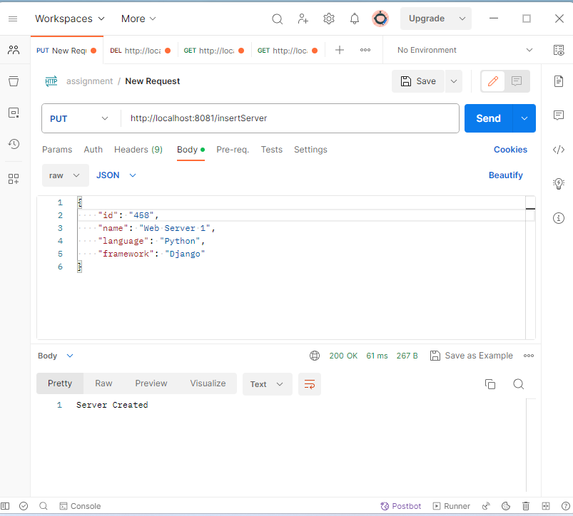
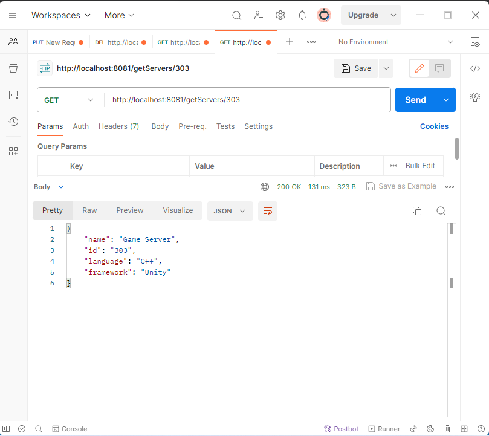
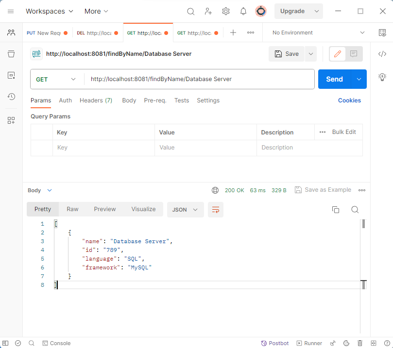
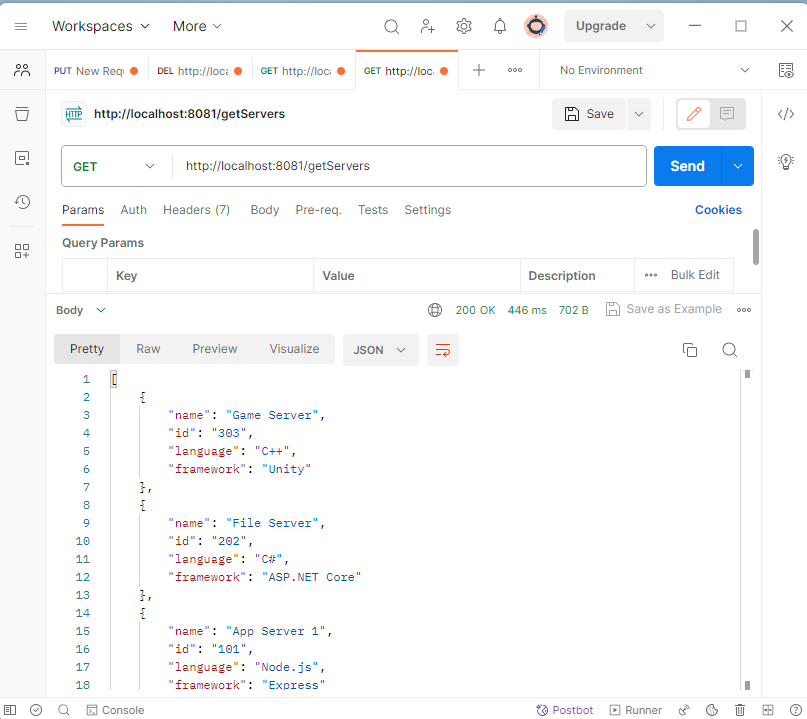
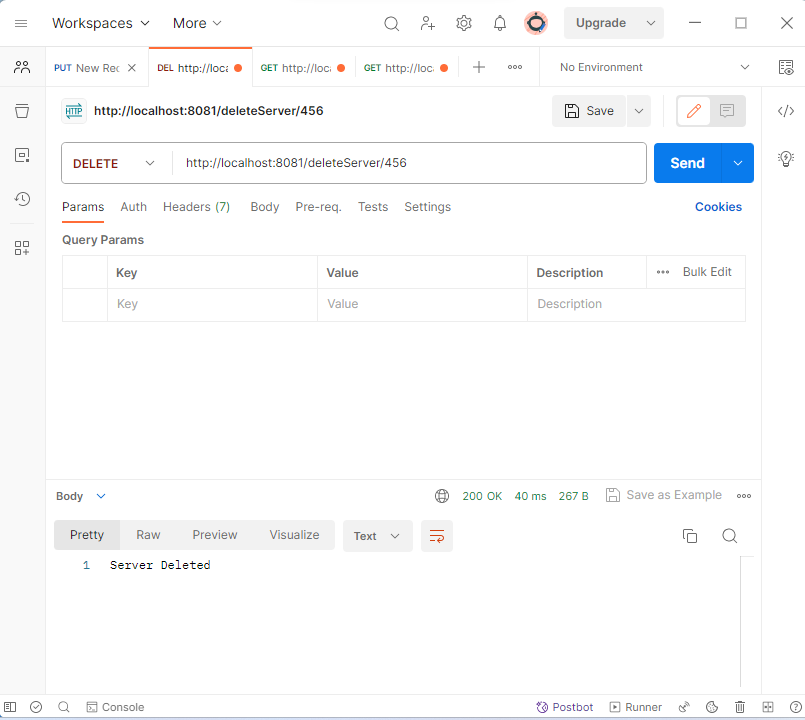

# Task 1. Java REST API

This documentation provides details about the Spring Boot REST API, including its endpoints and usage, and it has been tested using Postman.

## Endpoints

### Create Server

**Endpoint**: `/createServer`  
**Method**: POST  
**Description**: Create a new server object by providing the server's details.  
**Response**: Returns the created server object.  

### Get Server by ID

**Endpoint**: `/getServers/{id}`  
**Method**: GET  
**Description**: Retrieve server details by providing the server's ID.  
**Response**: Returns the server object if found; otherwise, returns a "404, Server not found" message.  

### Get Servers by Name

**Endpoint**: `/findByName/{name}`    
**Method**: GET  
**Description**: Search for servers by name and retrieve matching server details.  
**Response**: Returns a list of matching server objects.  

### Get All Servers

**Endpoint**: `/getServers`  
**Method**: GET  
**Description**: Retrieve a list of all servers in the database.  
**Response**: Returns an array of server objects.  

### Delete Server by ID

**Endpoint**: `/deleteServer/{id}`  
**Method**: DELETE  
**Description**: Delete a server by providing its ID.  
**Response**: Returns a success message upon successful deletion.  

## Postman Testing

To test the API using Postman, follow these steps:

1. Open Postman on your local machine.

2. Import the provided Postman collection (.json) or manually create requests for the API endpoints mentioned above.

3. Set the appropriate HTTP method and endpoint URL for each request.

4. Add request headers and bodies as needed, following the API documentation.

5. Send the request and examine the response.

## Screenshots

### Create Server

Screenshot: Creating a server using the "/insertServer"  in Postman.

### Get Server by ID 

Screenshot: Retrieving a server by ID using the "/getServers"  in Postman.

### Get Servers by Name 

Screenshot: Searching servers by name using the "/findByName/server_name" in Postman.

### Get All Servers 

Screenshot: Getting a list of all servers using the "/getAllServers"  in Postman.

### Delete Server by ID 

Screenshot: Deleting a server by ID using the "/deleteServer/server_ID" in Postman.

## Technologies Used

- Java Spring Boot: Backend framework for building the API.
- MongoDB: Database for storing server information.
- Postman: API testing and documentation tool.
- Other libraries and tools as needed.
